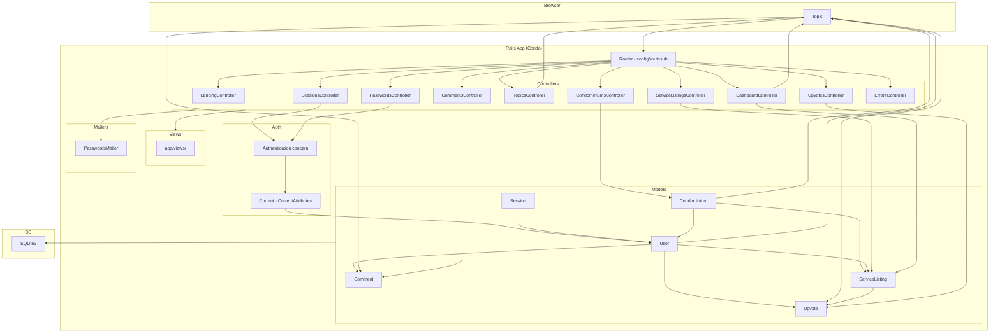
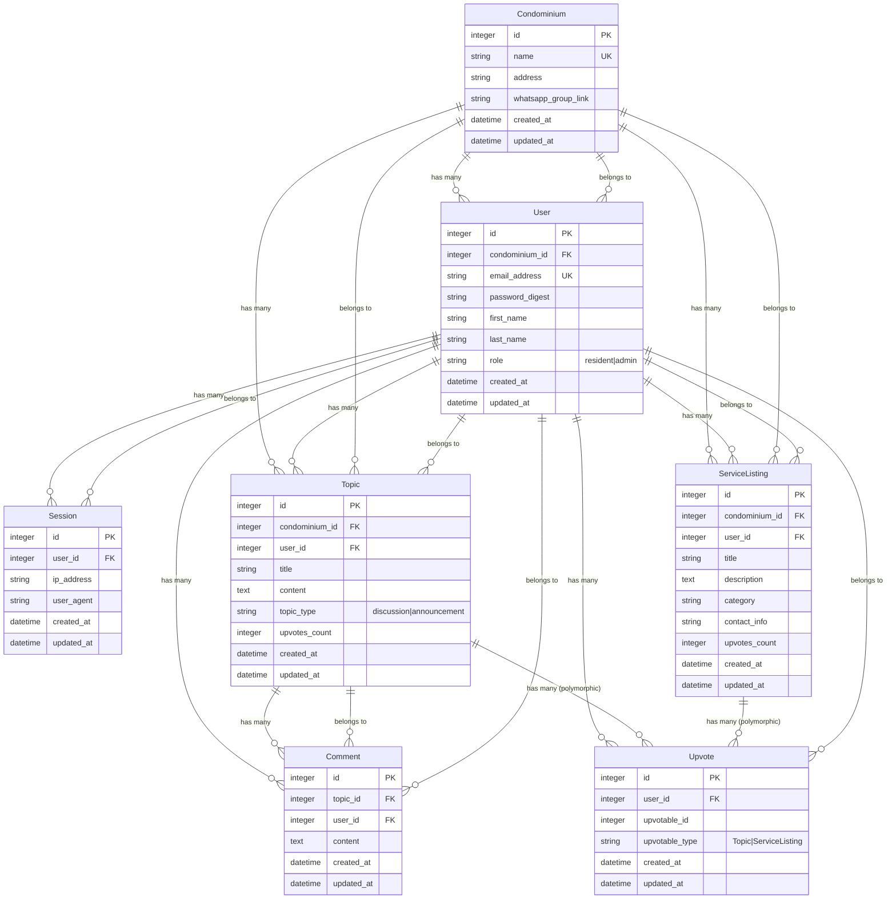

# CondoHub — Code Map

> **Rails 8.1** multi-tenant condominium community platform with custom auth, Hotwire, and i18n (en/pt-BR/es/ko).

---

## 1. Architecture Diagram (Mermaid)



---

## 2. Entity-Relationship Diagram (Mermaid)



---

## 3. Annotated Directory Tree

```
condohub/
├── AGENTS.md                         # Instructions for AI coding agents
├── CODEMAP.md                        # ← this file
├── README.md
├── Rakefile
├── Gemfile                           # Rails 8.1, SQLite3, BCrypt, Hotwire, i18n
├── Gemfile.lock
├── Dockerfile
├── fly.toml                          # Fly.io deployment config
├── .ruby-version
├── .rubocop.yml
│
├── app/
│   ├── controllers/
│   │   ├── application_controller.rb       # Base: locale setup, auth include
│   │   ├── concerns/
│   │   │   └── authentication.rb           # Session cookie auth logic
│   │   ├── landing_controller.rb           # Public landing page
│   │   ├── sessions_controller.rb          # Sign in/out + dev impersonation
│   │   ├── passwords_controller.rb         # Password reset flow
│   │   ├── dashboard_controller.rb         # Main 3-tab dashboard
│   │   ├── topics_controller.rb            # Show/create topics
│   │   ├── comments_controller.rb          # CRUD comments with Turbo Streams
│   │   ├── upvotes_controller.rb           # Toggle polymorphic upvotes
│   │   ├── service_listings_controller.rb  # Create service recommendations
│   │   ├── condominiums_controller.rb      # Admin: edit condo settings
│   │   └── errors_controller.rb            # 404/422/500 pages
│   │
│   ├── models/
│   │   ├── application_record.rb           # Base AR class
│   │   ├── condominium.rb                  # Tenancy root: name, address, WhatsApp
│   │   ├── user.rb                         # has_secure_password, roles, full_name
│   │   ├── session.rb                      # Auth session (cookie-bound)
│   │   ├── current.rb                      # CurrentAttributes (session + user delegation)
│   │   ├── topic.rb                        # Polymorphic upvotable, discussion/announcement
│   │   ├── comment.rb                      # Belongs to topic + user
│   │   ├── upvote.rb                       # Polymorphic: Topic or ServiceListing
│   │   └── service_listing.rb              # Service recommendations with upvotes
│   │
│   ├── views/
│   │   ├── layouts/
│   │   │   ├── application.html.erb        # Authenticated layout (nav, flash, theme, locale)
│   │   │   ├── landing.html.erb            # Public layout (embedded CSS, responsive)
│   │   │   ├── mailer.html.erb
│   │   │   └── mailer.text.erb
│   │   ├── landing/
│   │   │   └── index.html.erb              # Hero + 3 feature sections + CTA
│   │   ├── sessions/
│   │   │   └── new.html.erb                # Login form + dev impersonation sandbox
│   │   ├── dashboard/
│   │   │   └── index.html.erb              # 3-tab: Discussions, Announcements, Services
│   │   ├── topics/
│   │   │   ├── show.html.erb               # Topic detail + comments
│   │   │   ├── _comment.html.erb           # Turbo Frame comment card
│   │   │   ├── _comment_form.html.erb      # Turbo Frame inline edit
│   │   │   └── _comments_count.html.erb    # Comment count span
│   │   ├── passwords/
│   │   │   ├── new.html.erb                # Password reset request
│   │   │   └── edit.html.erb               # Password reset form
│   │   ├── passwords_mailer/
│   │   │   ├── reset.html.erb              # Reset email HTML
│   │   │   └── reset.text.erb              # Reset email plaintext
│   │   ├── condominiums/
│   │   │   └── edit.html.erb               # Admin settings form
│   │   ├── errors/
│   │   │   ├── not_found.html.erb          # 404
│   │   │   ├── internal_server_error.html.erb  # 500
│   │   │   └── unprocessable_entity.html.erb   # 422
│   │   └── pwa/
│   │       ├── manifest.json.erb           # PWA manifest
│   │       └── service-worker.js           # Stub with push notification hooks
│   │
│   ├── javascript/
│   │   ├── application.js                  # Imports Turbo + controllers
│   │   └── controllers/
│   │       ├── application.js              # Stimulus app init
│   │       ├── index.js                    # Eager-loads all controllers
│   │       ├── hello_controller.js         # Placeholder
│   │       ├── locale_switcher_controller.js  # Locale select → URL rewrite
│   │       └── theme_controller.js         # Dark/light mode toggle
│   │
│   ├── mailers/
│   │   ├── application_mailer.rb           # Base: default from, locale around_action
│   │   └── passwords_mailer.rb             # reset(user, locale:) → deliver_later
│   │
│   └── assets/
│       ├── stylesheets/
│       │   └── application.css             # Propshaft CSS manifest (/* ... */)
│       └── images/
│           ├── logo.svg                    # CondoHub logo
│           └── # ... (other static images)
│
├── config/
│   ├── application.rb                      # 4-locale i18n, Rails 8.1 defaults
│   ├── routes.rb                           # Locale-scoped, narrow resource routes
│   ├── database.yml                        # SQLite3 (dev/test/prod with separate dbs)
│   ├── importmap.rb                        # Turbo, Stimulus, controllers
│   ├── ci.rb                               # 7-step CI pipeline
│   ├── locales/
│   │   ├── en.yml                          # English (221 keys, full coverage)
│   │   ├── pt-BR.yml                       # Portuguese (default)
│   │   ├── es.yml                          # Spanish
│   │   └── ko.yml                          # Korean
│   ├── environments/
│   │   ├── development.rb
│   │   ├── test.rb
│   │   └── production.rb
│   └── initializers/
│       ├── assets.rb
│       ├── content_security_policy.rb      # CSP (commented out)
│       ├── filter_parameter_logging.rb     # Sensitive param filter
│       └── inflections.rb                  # condominium → condominiums
│
├── db/
│   ├── schema.rb                           # 6 tables, polymorphic upvotes
│   ├── migrate/                            # 10 migrations
│   └── seeds.rb                            # Sample data
│
├── test/
│   ├── test_helper.rb                      # Rails default + fixtures :all
│   ├── test_helpers/
│   │   └── session_test_helper.rb          # sign_in_as / sign_out for integration tests
│   ├── models/
│   │   ├── user_test.rb                    # Email normalization
│   │   ├── upvote_test.rb                  # Polymorphic + uniqueness + counter_cache
│   │   ├── comment_test.rb                 # Stub
│   │   ├── topic_test.rb                   # Stub
│   │   └── service_listing_test.rb         # Stub
│   ├── controllers/
│   │   ├── sessions_controller_test.rb     # Login/logout + impersonation guard
│   │   ├── passwords_controller_test.rb    # Reset flow (request, token, update)
│   │   ├── dashboard_controller_test.rb    # Auth guard, locale, sandbox visibility
│   │   ├── comments_controller_test.rb     # CRUD ownership + cross-condo isolation
│   │   ├── upvotes_controller_test.rb      # Toggle + cross-condo 404
│   │   ├── service_listings_controller_test.rb  # CRUD + isolation
│   │   └── errors_controller_test.rb       # 404/422/500 + catch-all
│   ├── fixtures/
│   │   ├── condominiums.yml                # 2 condos
│   │   ├── users.yml                       # 2 users (admin + resident)
│   │   ├── topics.yml                      # 2 topics
│   │   ├── comments.yml                    # 2 comments
│   │   ├── service_listings.yml            # 2 listings
│   │   └── upvotes.yml                     # Empty (minimal)
│   ├── integration/                        # (empty)
│   ├── helpers/                            # (empty)
│   └── mailers/
│       └── previews/
│           └── passwords_mailer_preview.rb # /rails/mailers/passwords_mailer/reset
│
└── config/
    └── ci.rb                               # CI steps: setup, rubocop, audit, brakeman, tests, seed
```

---

## 4. Route Map

| Method   | Path                              | Controller#Action              | Description                              |
|----------|-----------------------------------|--------------------------------|------------------------------------------|
| `GET`    | `/`                               | `landing#index`                | Public landing page                      |
| `GET`    | `/session/new`                    | `sessions#new`                 | Sign-in form                             |
| `POST`   | `/session`                        | `sessions#create`              | Authenticate user                        |
| `DELETE` | `/session`                        | `sessions#destroy`             | Sign out                                 |
| `POST`   | `/session/impersonate`            | `sessions#impersonate`         | Dev-only: sign in as any user            |
| `GET`    | `/passwords/new`                  | `passwords#new`                | Password reset request form              |
| `POST`   | `/passwords`                      | `passwords#create`             | Send reset email                         |
| `GET`    | `/passwords/:token/edit`          | `passwords#edit`               | Reset form (token-validated)             |
| `PATCH`  | `/passwords/:token`               | `passwords#update`             | Update password                          |
| `GET`    | `/dashboard`                      | `dashboard#index`              | Main dashboard (3 tabs)                  |
| `GET`    | `/topics/:id`                     | `topics#show`                  | Topic detail + comments                  |
| `POST`   | `/topics`                         | `topics#create`                | Create new topic                         |
| `POST`   | `/topics/:topic_id/comments`      | `comments#create`              | Add comment to topic                     |
| `GET`    | `/topics/:topic_id/comments/:id/edit` | `comments#edit`            | Turbo Frame: edit comment form           |
| `PATCH`  | `/topics/:topic_id/comments/:id`  | `comments#update`              | Update comment (Turbo Stream)            |
| `DELETE` | `/topics/:topic_id/comments/:id`  | `comments#destroy`             | Delete comment (Turbo Stream)            |
| `POST`   | `/topics/:topic_id/upvote`        | `upvotes#create`               | Toggle upvote on topic                   |
| `GET`    | `/condominium/edit`               | `condominiums#edit`            | Admin: condo settings form               |
| `PATCH`  | `/condominium`                    | `condominiums#update`          | Admin: update condo settings             |
| `POST`   | `/service_listings`               | `service_listings#create`      | Create service listing                   |
| `POST`   | `/service_listings/:id/upvote`    | `upvotes#create`               | Toggle upvote ("vouch") on service       |
| `GET`    | `/up`                             | `rails/health#show`            | Health check                             |
| `GET/*`  | `/errors/404`                     | `errors#not_found`             | 404 page                                 |
| `GET/*`  | `/errors/500`                     | `errors#internal_server_error` | 500 page                                 |
| `GET/*`  | `/errors/422`                     | `errors#unprocessable_entity`  | 422 page                                 |
| `*`      | `/*path`                          | `errors#not_found`             | Catch-all 404                            |

> All routes except health/errors are scoped under `/:locale` with regex `/en|pt\-BR|es|ko/`.

---

## 5. Layer-by-Layer Detail

### 5.1 Models

| Model            | Table              | Attributes (key)                                              | Associations                                        | Validations / Enums                |
|------------------|--------------------|---------------------------------------------------------------|-----------------------------------------------------|-------------------------------------|
| `Condominium`    | `condominiums`     | `name`, `address`, `whatsapp_group_link`                      | `has_many :users`, `:topics`, `:service_listings`   | `name` required; `whatsapp_group_link` format |
| `User`           | `users`            | `email_address`, `password_digest`, `first_name`, `last_name`, `role` | `belongs_to :condominium`; `has_many :sessions, :topics, :comments, :upvotes, :service_listings` | `email_address` unique; `role` enum: resident/admin; `has_secure_password` |
| `Session`        | `sessions`         | `ip_address`, `user_agent`                                   | `belongs_to :user`                                  | —                                   |
| `Topic`          | `topics`           | `title`, `content`, `topic_type`, `upvotes_count`            | `belongs_to :condominium, :user`; `has_many :comments, :upvotes` (as `:upvotable`) | `title` max 255, `content` required; enum: discussion/announcement; admins-only for announcements |
| `Comment`        | `comments`         | `content`                                                     | `belongs_to :topic, :user`                          | `content` required                  |
| `Upvote`         | `upvotes`          | `upvotable_type`, `upvotable_id`                              | `belongs_to :user`; `belongs_to :upvotable` (polymorphic, counter_cache) | Uniqueness scoped to [user, type, id] |
| `ServiceListing` | `service_listings` | `title`, `description`, `category`, `contact_info`, `upvotes_count` | `belongs_to :condominium, :user`; `has_many :upvotes` (as `:upvotable`) | `title`, `description`, `category` required |
| `Current`        | —                  | `session` (delegates `user`)                                  | —                                                   | `ActiveSupport::CurrentAttributes`  |

### 5.2 Controllers

| Controller              | Actions                          | Before Actions                                | Access                    |
|-------------------------|----------------------------------|-----------------------------------------------|---------------------------|
| `LandingController`     | `index`                          | `allow_unauthenticated_access`                | Public                    |
| `SessionsController`    | `new`, `create`, `destroy`, `impersonate` | `allow_unauthenticated_access` (except destroy) | Public + dev-only impersonate |
| `PasswordsController`   | `new`, `create`, `edit`, `update` | `allow_unauthenticated_access`; `set_user_by_token` (edit/update) | Public                    |
| `DashboardController`   | `index`                          | (default auth)                                | Authenticated             |
| `TopicsController`      | `show`, `create`                 | (default auth)                                | Authenticated             |
| `CommentsController`    | `create`, `edit`, `update`, `destroy` | `set_topic`, `set_comment`, `require_comment_owner` (edit/update/destroy) | Authenticated + owner     |
| `UpvotesController`     | `create`                         | (default auth)                                | Authenticated             |
| `ServiceListingsController` | `create`                      | (default auth)                                | Authenticated             |
| `CondominiumsController` | `edit`, `update`                | `require_admin`                               | Admin only                |
| `ErrorsController`      | `not_found`, `internal_server_error`, `unprocessable_entity` | `skip_before_action :require_authentication` | Public                    |

### 5.3 Views

| View directory       | Templates                                                      | Purpose                                  |
|----------------------|----------------------------------------------------------------|------------------------------------------|
| `layouts/`           | `application.html.erb`, `landing.html.erb`, `mailer.html.erb`, `mailer.text.erb` | App shells (authenticated, public, email) |
| `landing/`           | `index.html.erb`                                               | Hero + features + CTA                    |
| `sessions/`          | `new.html.erb`                                                 | Login form + dev sandbox                 |
| `dashboard/`         | `index.html.erb`                                               | 3-tab main interface                     |
| `topics/`            | `show.html.erb`, `_comment.html.erb`, `_comment_form.html.erb`, `_comments_count.html.erb` | Topic detail, comment partials (Turbo Frame) |
| `passwords/`         | `new.html.erb`, `edit.html.erb`                                | Reset request + password change          |
| `passwords_mailer/`  | `reset.html.erb`, `reset.text.erb`                              | Password reset email                     |
| `condominiums/`      | `edit.html.erb`                                                | Admin: edit condo settings               |
| `errors/`            | `not_found.html.erb`, `internal_server_error.html.erb`, `unprocessable_entity.html.erb` | Error pages                              |
| `pwa/`               | `manifest.json.erb`, `service-worker.js`                       | PWA support                              |

### 5.4 JavaScript (Stimulus Controllers)

| Controller                       | Targets      | Actions        | Purpose                                  |
|----------------------------------|--------------|----------------|------------------------------------------|
| `hello_controller.js`            | —            | —              | Placeholder (default Rails scaffold)     |
| `locale_switcher_controller.js`  | `select`     | `change`       | Rewrites URL with selected locale        |
| `theme_controller.js`            | `icon`       | `toggle`       | Dark/light mode, persists to localStorage|

### 5.5 Mailers

| Mailer              | Method                  | Purpose                           |
|---------------------|-------------------------|-----------------------------------|
| `ApplicationMailer` | `with_locale` (around_action) | Sets I18n locale for email      |
| `PasswordsMailer`   | `reset(user, locale:)`  | Sends password reset link         |

### 5.6 Tests

| Layer       | Files                                                                 | Coverage                                  |
|-------------|-----------------------------------------------------------------------|-------------------------------------------|
| Models      | `user_test.rb` · `upvote_test.rb` · `comment_test.rb` · `topic_test.rb` · `service_listing_test.rb` | Email normalization, upvote polymorphism/uniqueness/counter_cache (others: stubs) |
| Controllers | `sessions_controller_test.rb` · `passwords_controller_test.rb` · `dashboard_controller_test.rb` · `comments_controller_test.rb` · `upvotes_controller_test.rb` · `service_listings_controller_test.rb` · `errors_controller_test.rb` | Auth flow, password reset, dashboard, comment CRUD + ownership, upvote toggle, cross-condo isolation, error pages |
| Fixtures    | `condominiums.yml` · `users.yml` · `topics.yml` · `comments.yml` · `service_listings.yml` · `upvotes.yml` | 2 condos, 2 users, 2 topics, 2 comments, 2 listings, 0 upvotes |

---

## 6. Key Data Flows

### 6.1 Authentication Flow

```
Browser                          Rails App
   │                                │
   │  POST /en/session              │
   │  { email, password }           │
   │──────────────────────────────> │
   │                                ├─ SessionsController#create
   │                                ├─ User.find_by(email_address: ...)
   │                                ├─ user.authenticate(params[:password])
   │                                ├─ start_new_session_for(user)
   │                                │    ├─ Session.create!(user: user)
   │                                │    └─ cookies.signed[:session_id] = session.id
   │                                ├─ Current.session = session
   │                                └─ redirect_to after_authentication_url
   │
   │  Subsequent requests           │
   │  Cookie: session_id=<signed>   │
   │──────────────────────────────> │
   │                                ├─ Authentication#resume_session
   │                                │    ├─ Session.find_by(id: cookies.signed[:session_id])
   │                                │    └─ Current.session = session
   │                                ├─ Current.user (via delegate)
   │                                └─ current_condominium = current_user.condominium
   │
   │  DELETE /en/session            │
   │──────────────────────────────> │
   │                                ├─ SessionsController#destroy
   │                                ├─ terminate_session
   │                                │    ├─ Current.session.destroy!
   │                                │    └─ cookies.delete(:session_id)
   │                                └─ redirect_to new_session_path
```

### 6.2 Multi-Tenant Isolation Flow

```
                     ┌──────────────────────┐
                     │   Condominium A      │
                     │   ┌──────────────┐   │
                     │   │ User A1      │   │
                     │   │ Topic A1     │   │
                     │   │ Comment A1   │   │
                     │   │ Service A1   │   │
                     │   └──────────────┘   │
                     └──────────────────────┘

                     ┌──────────────────────┐
                     │   Condominium B      │
                     │   ┌──────────────┐   │
                     │   │ User B1      │   │
                     │   │ Topic B1     │   │
                     │   │ Comment B1   │   │
                     │   │ Service B1   │   │
                     │   └──────────────┘   │
                     └──────────────────────┘

  User A1 requests /topics/1
      │
      ├─ current_condominium = User A1's condominium # => Condominium A
      ├─ current_condominium.topics.find(params[:id])
      │   (scoped: only Topic A1 is visible)
      │
      └─ If User A1 tries /topics/2 (belongs to Condominium B)
           → ActiveRecord::RecordNotFound → 404
```

### 6.3 Upvote Toggle Flow (Polymorphic)

```
  POST /en/topics/1/upvote   (or /en/service_listings/1/upvote)
      │
      ├─ UpvotesController#create
      ├─ Find upvotable: current_condominium.topics.find(params[:topic_id])
      │                  (or current_condominium.service_listings.find(...))
      ├─ Find existing upvote: current_user.upvotes.find_by(upvotable: upvotable)
      │
      ├─ If exists:
      │   └─ upvote.destroy!  →  counter_cache decrements
      │
      └─ If not exists:
          └─ Upvote.create!(user: current_user, upvotable: upvotable)
               → counter_cache increments
      │
      └─ redirect_back(fallback_location: dashboard_path)
```

### 6.4 Comment Edit Flow (Turbo Stream)

```
  GET /en/topics/1/comments/1/edit
      │
      ├─ Turbo Frame request (<turbo-frame id="comment_1">)
      ├─ Renders _comment_form.html.erb inside the frame
      │
  PATCH /en/topics/1/comments/1
      │
      ├─ Turbo Stream format
      ├─ If valid:  render _comment.html.erb → replaces frame
      └─ If invalid: render _comment_form.html.erb with errors
```

---

## 7. Tech Stack Summary

| Category        | Technology                       |
|-----------------|----------------------------------|
| Framework       | Ruby on Rails 8.1.3              |
| Language        | Ruby 3.4+                        |
| Database        | SQLite3 2.1+                     |
| Auth            | Custom (signed cookies, BCrypt)  |
| Frontend        | Hotwire (Turbo + Stimulus)       |
| Assets          | Propshaft + Importmap            |
| I18n            | rails-i18n, 4 locales            |
| Background      | Solid Queue                      |
| Cache           | Solid Cache                      |
| Cable           | Solid Cable                      |
| CSS             | App CSS (no framework)           |
| Testing         | Minitest, fixtures, Capybara     |
| Linting         | RuboCop (rails-omakase)          |
| Security        | Brakeman, bundler-audit          |
| Deploy          | Docker, Kamal, Fly.io            |

---

*Generated from source — last updated Jul 2026.*
