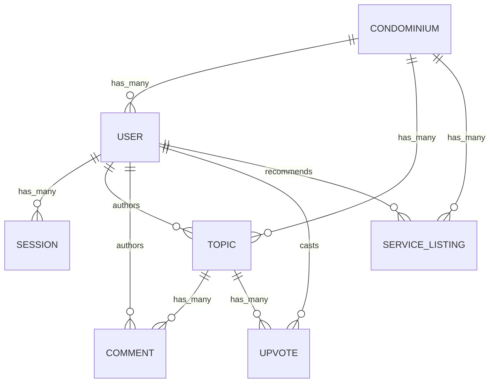

# CondoHub: Database and Domain Architecture

This document reflects the current implementation in this repository rather than the earlier prototype naming. The app is a Rails 8.1 community platform for condominium residents, backed by SQLite in development and test and a schema defined in [db/schema.rb](db/schema.rb).

## Current schema at a glance

## Main tables

### `condominiums`

Stores the condominium community that owns the content.

- `id`
- `name` (required)
- `address`
- `created_at`, `updated_at`

### `users`

Represents residents or admins within a condominium.

- `id`
- `condominium_id` (required, foreign key)
- `email_address` (required, unique, normalized to lowercase)
- `password_digest` (required)
- `first_name`, `last_name` (required)
- `role` (defaults to `resident`)
- `created_at`, `updated_at`

### `sessions`

Tracks the custom, cookie-based authentication sessions used by the app.

- `id`
- `user_id` (required, foreign key)
- `ip_address`
- `user_agent`
- `created_at`, `updated_at`

### `topics`

Stores discussion posts and announcements in a single table using `topic_type`.

- `id`
- `condominium_id` (required, foreign key)
- `user_id` (required, foreign key)
- `title` (required)
- `content` (required)
- `topic_type` (defaults to `discussion`)
- `upvotes_count` (defaults to `0`)
- `created_at`, `updated_at`

### `comments`

Stores replies to topics.

- `id`
- `topic_id` (required, foreign key)
- `user_id` (required, foreign key)
- `content` (required)
- `created_at`, `updated_at`

### `upvotes`

Tracks topic votes and prevents duplicate votes through a unique index on `user_id` and `topic_id`.

- `id`
- `user_id` (required, foreign key)
- `topic_id` (required, foreign key)
- `created_at`, `updated_at`

### `service_listings`

Stores service recommendations that are separate from general discussion topics.

- `id`
- `condominium_id` (required, foreign key)
- `user_id` (required, foreign key)
- `title` (required)
- `description` (required)
- `contact_info`
- `category` (required)
- `upvotes_count` (defaults to `0`)
- `created_at`, `updated_at`

## Current model relationships

The implementation in the app currently uses these names:

- `Condominium` has many `users`, `topics`, and `service_listings`
- `User` belongs to `condominium` and has many `sessions`, `topics`, `comments`, `upvotes`, and `service_listings`
- `Topic` belongs to `condominium` and `user`, and has many `comments` and `upvotes`
- `Comment` belongs to `topic` and `user`
- `Upvote` belongs to `user` and `topic`, and uses the topic counter cache
- `ServiceListing` belongs to `condominium` and `user`
- `Session` belongs to `user`

The current auth flow is custom rather than Devise-based. It lives in [app/controllers/concerns/authentication.rb](app/controllers/concerns/authentication.rb) and uses `Current.session` and `Current.user`.

## Architecture notes

### 1. Discussions and announcements share one table

The app uses a single `topics` table with a `topic_type` enum for both `discussion` and `announcement` entries. This keeps the core feed simple while allowing the dashboard to render separate tabs.

### 2. Upvotes use counter caching

`Upvote` updates `topics.upvotes_count` through Active Record’s counter cache. This is the current approach for fast sorting by popularity.

### 3. Service recommendations are modeled separately

`service_listings` is a separate domain object from `topics` because service recommendations need structured fields like category and contact information.

### 4. Condominium-level isolation is enforced in the application layer

Each record is scoped through the current condominium via [app/controllers/application_controller.rb](app/controllers/application_controller.rb). This keeps the app simple for the MVP while avoiding cross-condominium data leakage.

## Implementation references

- [db/schema.rb](db/schema.rb)
- [app/models/condominium.rb](app/models/condominium.rb)
- [app/models/user.rb](app/models/user.rb)
- [app/models/topic.rb](app/models/topic.rb)
- [app/models/comment.rb](app/models/comment.rb)
- [app/models/upvote.rb](app/models/upvote.rb)
- [app/models/service_listing.rb](app/models/service_listing.rb)
- [app/models/session.rb](app/models/session.rb)
- [config/routes.rb](config/routes.rb)
